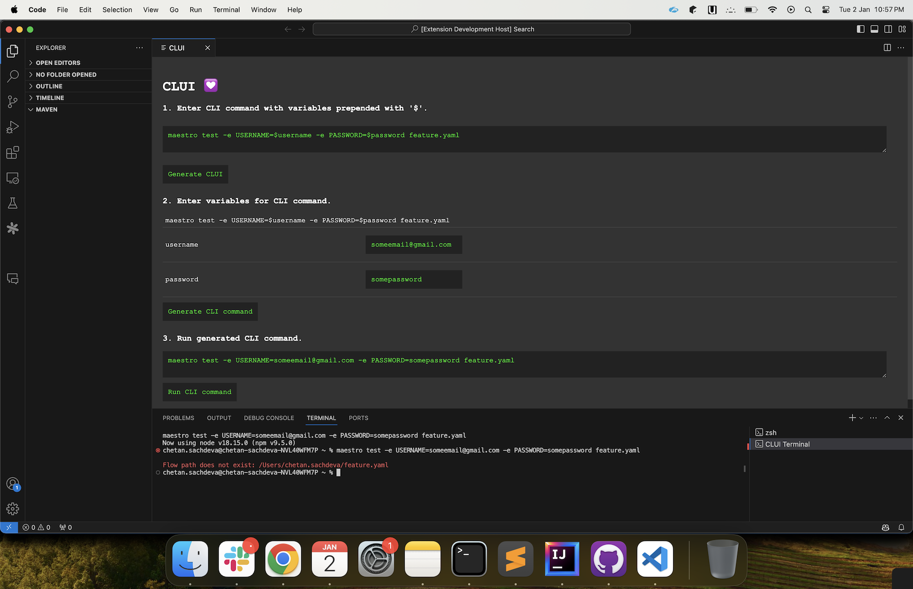

# CLUI 💟

CLUI adds UI to your CLI.

Medium blog: https://medium.com/@chet.deva/enhance-your-cli-experience-with-clui-96eed88929c8



## Features

Your commands can have variables prepended with '$'. These variables will be rendered as input boxes and can be run as a CLI command.

## Steps to install CLUI

- Open VSCode
- Install CLUI extension.
- Click Cmd+Shift+P and type "Run CLUI".
- Select "Run CLUI" and click enter.

## Steps to run CLUI

[CLUI](https://chetdeva.github.io/clui/) + [maestro](https://maestro.mobile.dev/) an be used for everyday mobile/web development and ease E2E testing. Sample maestro flows can be in https://github.com/chetdeva/maestro-flows

### 1. Enter CLI commands with variables prepended with '$'.
```
maestro test -e USERNAME=$USERNAME -e PASSWORD=$PASSWORD feature.yaml
```
Click "Generate CLUI" button.

### 2. Enter variables for CLI commands.
```
$USERNAME featureUsername
$PASSWORD featurePassword
```
Click "Generate CLI commands"

### 3. Run generated CLI commands button.
```
maestro test -e USERNAME=featureUsername -e PASSWORD=featurePassword feature.yaml`
```
Click "Run CLI commands" button.

## Requirements

Visual Studio Code 1.85.0 or higher.

## Release Notes

### 0.0.10

Beta release

### Upcoming features

- Save and share CLUI shell scripts.

## Following extension guidelines

Ensure that you've read through the extensions guidelines and follow the best practices for creating your extension.

* [Extension Guidelines](https://code.visualstudio.com/api/references/extension-guidelines)

## Contributing

Pull requests are welcome. For contributing, create a fork and a pull request.

[How to contribute](https://github.com/MarcDiethelm/contributing/blob/master/README.md)

## License

[Apache License 2.0](https://choosealicense.com/licenses/apache-2.0/)
